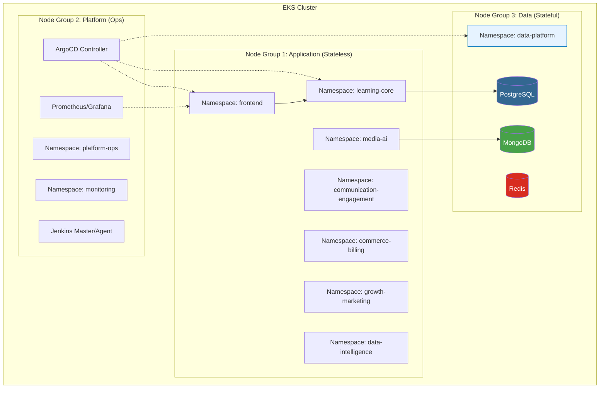
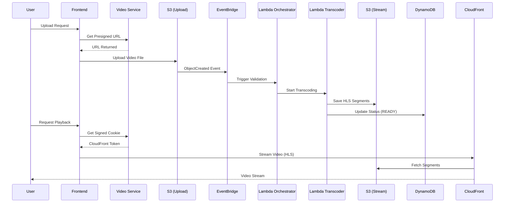
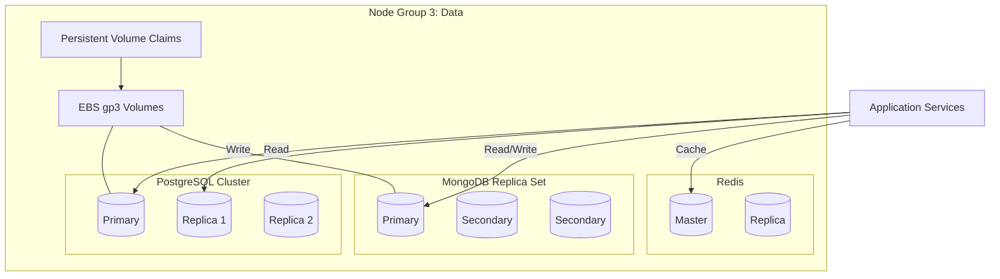

# 📐 Architecture Diagrams
## Learning Hub Production Platform

This document contains the architecture diagrams for the Learning Hub platform, based on the `PRODUCTION_DEPLOYMENT_PLAN.md`.
These diagrams are written in **Mermaid**, which allows for version control, easy editing, and rendering in most modern Markdown viewers (GitHub, VS Code, etc.).

### 1. ☁️ Cloud Infrastructure (AWS Multi-AZ)
Representation of the VPC, Subnets, and Networking layer.

```mermaid
graph TB
    subgraph "AWS Cloud (us-east-1)"
        subgraph "VPC (10.0.0.0/16)"
            subgraph "Public Subnets (Layer 1)"
                ALB[Application Load Balancer]
                NAT[NAT Gateways x3]
                IGW[Internet Gateway]
            end

            subgraph "Private App Subnets (Layer 2)"
                EKS_CP[EKS Control Plane]
                Lambda[Lambda Functions]
                NG_APP[Node Group 1: Application]
                NG_OPS[Node Group 2: Platform Ops]
            end

            subgraph "Private Data Subnets (Layer 3)"
                NG_DATA[Node Group 3: Data (Stateful)]
                EBS[EBS Volumes]
            end
        end
        
        Internet((Internet)) --> IGW
        IGW --> ALB
        ALB --> NG_APP
        NG_APP --> NG_DATA
        NG_OPS --> NG_APP
        NG_APP --> NAT
        NAT --> IGW
    end
    
    style ALB fill:#FF9900,stroke:#232F3E
    style EKS_CP fill:#FF9900,stroke:#232F3E
    style Lambda fill:#FF9900,stroke:#232F3E
    style NG_DATA fill:#3F8624,stroke:#232F3E
```

### 2. ☸️ Kubernetes Cluster Architecture
Detailed view of Node Groups, Namespaces, and Workload distribution.



### 3. 🎥 Video Processing Pipeline
Hybrid Serverless + EKS workflow for media handling.



### 4. ⚙️ CI/CD Pipeline (Jenkins + ArgoCD)
Separation of Continuous Integration and Continuous Deployment.

```mermaid
flowchart LR
    subgraph "CI: Jenkins (Shared Library)"
        Code[Checkout Code] --> Test[Unit Tests & Lint]
        Test --> Sec[Security Scan (Trivy/OWASP)]
        Sec --> Build[Docker Build]
        Build --> Push[Push to ECR]
        Push --> Update[Update GitOps Repo (Tags)]
    end

    subgraph "CD: ArgoCD (GitOps)"
        GitOps[GitOps Repo] --> Sync[ArgoCD Sync]
        Sync --> Apply[Apply Manifests]
        Apply --> EKS[EKS Cluster]
    end

    Update -.-> GitOps
    
    style CI fill:#D4EBF2
    style CD fill:#F2D4D4
    style Code fill:#FFFFFF
    style EKS fill:#326CE5,color:white
```

### 5. 🗄️ Detailed Database Architecture
Containerized StatefulSets on dedicated nodes.


